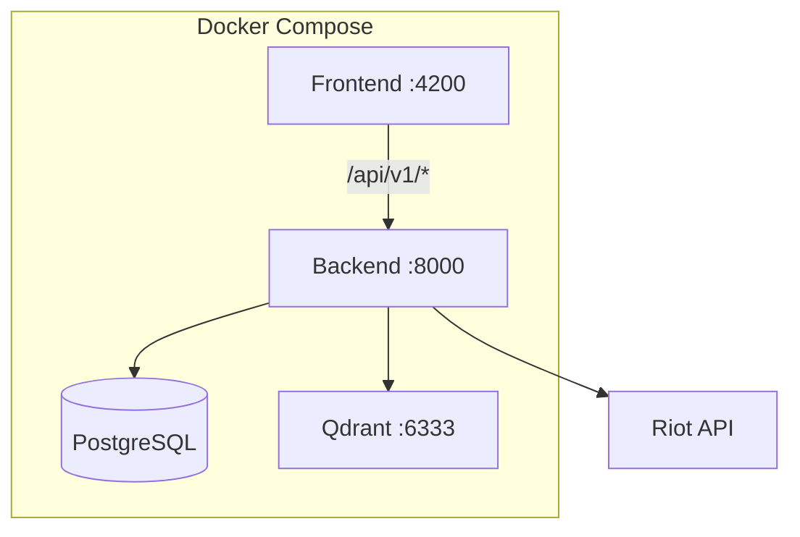

# NexusIQ – AI Coach for League of Legends

NexusIQ is an experimental AI coach for League of Legends players. The goal: turn raw match data into actionable insights about your macro, micro and decision-making – so you can climb smarter, not just play more.

## What NexusIQ aims to do

- Analyze your games with AI instead of static stats pages
- Highlight recurring mistakes (positioning, objective calls, wave management)
- Suggest concrete next steps to improve, tailored to your role and elo
- Serve as a long-term coach that tracks your progress over time

> **Status:** Early prototype / work in progress. Expect breaking changes and missing features.

## Architecture

- **Backend** (FastAPI, Python 3.13): REST API at `/api/v1/*`, Riot API client, Qdrant for RAG, PostgreSQL
- **Frontend** (Angular 21, Tailwind, SSR-capable): SPA with dev proxy and prod Nginx
- **Services**: `backend`, `frontend`, `database` (Postgres 18), `qdrant`; optional `pgadmin` via `compose.override.yaml`



## Prerequisites

- **Docker & Docker Compose**
- **Riot API key** (required) – obtain from [Riot Developer Portal](https://developer.riotgames.com/)
- Optional: Node 24, Python 3.13 for local development without full Docker

## Getting Started

```bash
git clone https://github.com/jasonbdt/nexus-iq.git
cd nexus-iq
docker compose up -d --build
```

- **Frontend:** http://localhost:4200
- **Backend:** http://localhost:8000
- **API docs:** http://localhost:8000/api/v1/docs (when backend is running)
- **pgAdmin:** http://localhost:8001 (if using `compose.override.yaml`)

The override file adds pgAdmin and volume mounts for hot-reloading the backend.

## Development Workflows

- **All-in-Docker:** `docker compose up` – frontend proxies to backend at `backend:8000`
- **Backend only (Docker):** Run backend + database + Qdrant via Docker; run frontend locally with `ng serve`. Update `frontend/proxy.conf.json` target to `http://localhost:8000`
- **Backend tests:** `pytest` (from repo root; `tests/conftest.py` sets env defaults)
- **Frontend tests:** `cd frontend && ng test` (Vitest)

## Project Structure

```
nexus-iq/
├── app/                 # FastAPI backend
│   ├── main.py          # Entry point, routers
│   ├── routers/         # auth, coach, matches, summoners, users, rag
│   ├── internal/        # DB, auth, Riot API, vector store
│   └── dependencies.py  # Env/config
├── frontend/            # Angular 21 app
│   ├── src/app/         # Components, services, routes
│   └── proxy.conf.json  # Dev proxy to backend
├── ddragon/             # LoL static assets (see ddragon/README.md)
├── tests/               # Pytest tests
├── compose.yaml         # Dev stack
└── compose.prod.yaml    # Production overrides
```

## API Overview

| Router | Description |
|--------|-------------|
| `/auth` | Register, login |
| `/users` | User CRUD, link summoner |
| `/summoners` | Search, update |
| `/matches` | Match history by region/puuid |
| `/coach` | Coaching sessions, chat |
| `/rag` | Patches ingest, query (streaming) |
| `/cdn/*` | DDragon static assets |

See [API documentation](http://localhost:8000/api/v1/docs) for full OpenAPI spec.

## DDragon Assets

Profile icons, champion images, and rank emblems are served from local Data Dragon files. See [ddragon/README.md](ddragon/README.md) for setup. The app serves them at `/api/v1/cdn/...`. Without DDragon files, some UI assets will 404.

## Deployment

To serve the project in production on a host machine:

1. **Create `.env.prod`** with production values (RIOT_API_KEY, database credentials, JWT_SECRET, etc.).

2. **Run the full stack** with the production compose override:

   ```bash
   docker compose -f compose.yaml -f compose.prod.yaml up -d --build
   ```

3. **Services exposed:**
   - **Frontend:** Nginx serves the built Angular app on port **8080** and proxies `/api/v1/*` to the backend.
   - **Backend:** FastAPI runs via `fastapi run`; internal port 8000 (not exposed in prod; frontend proxies to it).

4. **Reverse proxy (recommended):** Put Nginx, Caddy, or Traefik in front to add HTTPS, domain routing, and rate limiting. Point your domain at the host and proxy to `http://localhost:8080`.

## Contributing

Contributions, ideas and feedback on the coaching approach are welcome. Please run tests before submitting (`pytest` for backend, `ng test` for frontend).
